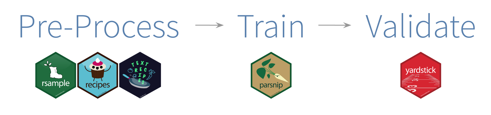

```{r, eval = FALSE, echo = FALSE}
The general outline of the talk is:

Introduction
Motivation
talk about data
Start modeling
side tangent - talk about one of chapter 1-5
more modeling
side tangent - talk about one of chapter 1-5
finish modeling
evaluate

We will be doing 1 model workflow from start to finish, with sidestepping to talk about chapter 1-5 things

```


```{r include=FALSE}
library(knitr)
hook_output <- knit_hooks$get("output")
knit_hooks$set(output = function(x, options) {
  lines <- options$output.lines
  if (is.null(lines)) {
    return(hook_output(x, options))  # pass to default hook
  }
  x <- unlist(strsplit(x, "\n"))
  more <- "..."
  if (length(lines) == 1) {        # first n lines
    if (length(x) > lines) {
      # truncate the output, but add ....
      x <- c(head(x, lines), more)
    }
  } else {
    x <- c(more, x[lines], more)
  }
  # paste these lines together
  x <- paste(c(x, ""), collapse = "\n")
  hook_output(x, options)
})
knit_hooks$set(output = function(x, options) {
  # this hook is used only when the linewidth option is not NULL
  if (!is.null(n <- options$linewidth)) {
    x = knitr:::split_lines(x)
    # any lines wider than n should be wrapped
    if (any(nchar(x) > n)) x = strwrap(x, width = n)
    x = paste(x, collapse = '\n')
  }
  hook_output(x, options)
})

opts_chunk$set(
  echo = TRUE,
  cache = FALSE,
  fig.width = 7, 
  fig.align = 'center',
  fig.asp = 0.618, # 1 / phi
  out.width = "700px",
  fig.retina = 3)
```

```{r, echo = FALSE}
library(sass)
sass(sass_file("theme.sass"), output = "theme.css")
set.seed(1234)
library(ggplot2)
theme_set(theme_minimal())
library(countdown) 
```

# Text as data

Let's take a look at the data again

```{r R.options = list(width = 80), message=FALSE}
library(tidyverse)
library(animals)

glimpse(animals)
```

---

# Text as data

```{r, linewidth = 80}
animals %>%
  sample_n(1) %>%
  pull(text)
```

---

# Text as data


- Text like this can be used for **supervised** or **predictive** modeling


--


- We can build both regression and classification models with text data


--


- We can use the ways language exhibits organization to create features for modeling


---

# Modeling Packages

```{r, message=FALSE}
library(tidymodels)
library(textrecipes)
```

- [tidymodels](https://www.tidymodels.org/) is a collection of packages for modeling and machine learning using tidyverse principles
- [textrecipes](https://textrecipes.tidymodels.org/) extends the recipes package to handle text preprocessing

---

# Modeling workflow



---

.pull-left[
# Modeling task

You are a new zoo keeper and your job is to figure out what to feed each animal based on a written description and some other metrics that are available for you
]

--

.pull-right[
## Question

Is this a realistic problem to have?

Would it be a good use-case for Machine learning?

```{r, echo=FALSE}
countdown(2, 0)
```

]

---

# Notes

- This could be better handled by an expert
- Disastrous results with misclassifications
- Overlap between classes
- Has an "unknown" field
- Uses both numeric/factor variables and text variables

---

# Class imbalance

```{r, echo=FALSE}
animals %>%
  ggplot(aes(y = diet)) +
  geom_bar() +
  labs(x = NULL, y = NULL)
```

---

class: inverse, right, middle

# Let's approach this as a **multiclass classification task**

---

# Data splitting

The testing set is a precious resource which can be used only once

```{r all-split, echo = FALSE, fig.width=10}
set.seed(16)
one_split <- slice(animals, 1:30) %>% 
  initial_split() %>% 
  tidy() %>% 
  add_row(Row = 1:30, Data = "Original") %>% 
  mutate(Data = case_when(
    Data == "Analysis" ~ "Training",
    Data == "Assessment" ~ "Testing",
    TRUE ~ Data
  )) %>% 
  mutate(Data = factor(Data, levels = c("Original", "Training", "Testing")))

all_split <-
  ggplot(one_split, aes(x = Row, y = fct_rev(Data), fill = Data)) + 
  geom_tile(color = "white",
            size = 1) + 
  #scale_fill_manual(values = splits_pal, guide = FALSE) +
  theme_minimal() +
  theme(axis.text.y = element_text(size = rel(2)),
        axis.text.x = element_blank(),
        legend.position = "top",
        panel.grid = element_blank()) +
  coord_equal(ratio = 1) +
  labs(x = NULL, y = NULL)

all_split
```

---

# Data splitting

## With {yardstick}

```{r}
set.seed(1234)
animals_split <- initial_split(animals)

animals_training <- training(animals_split)
animals_testing <- testing(animals_split)
```

---

# Your turn #4

Specify stratification variable `diet` and extract the `testing()` and `training()` dataset

```{r, eval=FALSE}
set.seed(1234)
animals_split <- initial_split(animals, strata = ___)

animals_split

animals_training <- ___(animals_split)
animals_testing <- ___(animals_split)
```

---

# Your turn #4 - results

Setting `strata = diet` makes sure that the proportions of diet is preserved in the split

```{r}
set.seed(1234)
animals_split <- initial_split(animals, strata = diet)

animals_split

animals_training <- training(animals_split)
animals_testing <- testing(animals_split)
```

---

class: inverse

# What mistake have we made already?

```{r, echo=FALSE}
countdown(2, 0)
```


---

class: inverse

# What mistake have we made already?

### We did EDA on the whole dataset

### By not restricting to training set => data leakage

---

# Feature selection checklist

--


- Is it ethical to use this variable? (or even legal?)


--


- Will this variable be available at prediction time?


--


- Does this variable contribute to explainability?

---

## Our Variables

Response: `diet`

Categorical: `lifecycle`

Numeric: `mean_weight`

Text: `text`

---

# Categorical: lifestyle

--

```{r, fig.asp = 0.5}
animals_training %>%
  count(lifestyle) %>%
  ggplot(aes(lifestyle, n)) +
  geom_col()
```

---

# How should we deal with lifestyle?

- Missing values
- many categories

```{r, echo=FALSE}
countdown(2, 0)
```

---

class: center

# {recipes}

Flexible and reproducible preprocessing framework


---

class: middle

# How to build a recipe

1. Start the recipe()
2. Define the variables involved
3. Describe preprocessing step-by-step

---

# recipe()

Creates a recipe for a set of variables

```{r, eval=FALSE}
recipe(reponse ~ ., data = data_set)
```

---

# recipe()

Creates a recipe for a set of variables

```{r}
recipe(diet ~ ., data = animals_training)
```

---

# step_*()

Complete list at https://recipes.tidymodels.org/reference/

---

# lifestyle steps

`step_unknown()` will replace missing values with `unknown` level

```{r}
rec_spec <- recipe(diet ~ ., 
                   data = animals_training) %>%
  step_unknown(lifestyle) %>%
  prep()

rec_spec
```

---

# lifestyle steps

`step_other()` will pool together low frequency values

---

## Your turn #5

Specify variables and play around with the threshold, default is 0.05

```{r, eval=FALSE}
rec_spec <- recipe(diet ~ ., 
                   data = animals_training) %>%
  step_unknown(lifestyle) %>%
  step_other(___, threshold = ___)

rec_spec %>%
  tidy(2)
```

```{r, echo=FALSE}
countdown(2, 0)
```

---

## Your turn #5 - result

Specify variables and play around with the threshold, default is 0.05

```{r}
rec_spec <- recipe(diet ~ ., 
                   data = animals_training) %>%
  step_unknown(lifestyle) %>%
  step_other(lifestyle, threshold = 0.05)

rec_spec %>%
  prep() %>%
  tidy()
```

---

## Your turn #5 - result

Specify variables and play around with the threshold, default is 0.05

```{r}
rec_spec <- recipe(diet ~ ., 
                   data = animals_training) %>%
  step_unknown(lifestyle) %>%
  step_other(lifestyle, threshold = 0.05) 

rec_spec %>%
  prep() %>%
  tidy(2)
```

---

## Your turn #5 - result

Specify variables and play around with the threshold, default is 0.05

```{r}
rec_spec <- recipe(diet ~ ., 
                   data = animals_training) %>%
  step_unknown(lifestyle) %>%
  step_other(lifestyle, threshold = 0.1)

rec_spec %>%
  prep() %>%
  tidy(2)
```

---

## Your turn #5 - result

Specify variables and play around with the threshold, default is 0.05

```{r}
rec_spec <- recipe(diet ~ ., 
                   data = animals_training) %>%
  step_unknown(lifestyle) %>%
  step_other(lifestyle, threshold = 0.01)

rec_spec %>%
  prep() %>%
  tidy(2)
```

---

## Dummifying

Specify variables and play around with the threshold, default is 0.05

```{r}
rec_spec <- recipe(diet ~ ., 
                   data = animals_training) %>%
  step_unknown(lifestyle) %>%
  step_other(lifestyle, threshold = 0.01) %>%
  step_dummy(lifestyle)

rec_spec
```

---

# Numeric - mean_weight

```{r, warning=FALSE, message=FALSE, fig.asp=0.5}
animals_training %>%
  ggplot(aes(mean_weight)) +
  geom_histogram()
```

---

# Numeric - mean_weight

```{r, warning=FALSE, message=FALSE, fig.asp=0.5}
animals_training %>%
  ggplot(aes(mean_weight)) +
  geom_histogram() +
  scale_x_log10()
```

---

# Logging and mean imputation

```{r}
rec_spec <- recipe(diet ~ ., 
                   data = animals_training) %>%
  step_unknown(lifestyle) %>%
  step_other(lifestyle, threshold = 0.01) %>%
  step_dummy(lifestyle) %>%
  step_log(mean_weight) %>%
  step_meanimpute(mean_weight)
```

---

class: middle

# Text preprocessing workflow

- turn text into tokens
- modify/filter tokens
- count tokens

---

## Text preprocessing workflow - tokenize

.pull-left[
```{r, eval=FALSE}
recipe(diet ~ ., 
       data = animals_training) %>%
  # Tokenize to words
  step_tokenize(text)
```
]

.pull-right[
```{r, echo=FALSE}
recipe(diet ~ ., 
       data = animals_training) %>%
  # Tokenize to words
  step_tokenize(text)
```
]


---

## Text preprocessing workflow - modify tokens

.pull-left[
```{r, eval=FALSE}
recipe(diet ~ ., 
       data = animals_training) %>%
  # Tokenize to words
  step_tokenize(text) %>%
  # Remove stopwords
  step_stopwords(text) %>%
  # Remove less frequent words
  step_tokenfilter(text, max_tokens = 100)
```
]

.pull-right[
```{r, echo=FALSE}
recipe(diet ~ ., 
       data = animals_training) %>%
  # Tokenize to words
  step_tokenize(text) %>%
  # Remove stopwords
  step_stopwords(text) %>%
  # Remove less frequent words
  step_tokenfilter(text, max_tokens = 100)
```
]

---

## Text preprocessing workflow - count tokens

.pull-left[
```{r, eval=FALSE}
recipe(diet ~ ., 
       data = animals_training) %>%
  # Tokenize to words
  step_tokenize(text) %>%
  # Remove stopwords
  step_stopwords(text) %>%
  # Remove less frequent words
  step_tokenfilter(text, max_tokens = 100) %>%
  # Calculate term frequencies
  step_tf(text)
```
]

.pull-right[
```{r, echo=FALSE}
recipe(diet ~ ., 
       data = animals_training) %>%
  # Tokenize to words
  step_tokenize(text) %>%
  # Remove stopwords
  step_stopwords(text) %>%
  # Remove less frequent words
  step_tokenfilter(text, max_tokens = 100) %>%
  # Calculate term frequencies
  step_tf(text)
```
]

---

### Your turn #6

play around with the arguments in step_tokenfilter() and see what results we get

```{r, eval=FALSE}
rec_spec <- recipe(diet ~ ., 
                   data = animals_training) %>%
  step_tokenize(text) %>%
  step_stopwords(text) %>%
  step_tokenfilter(text, max_tokens = 100) %>%
  step_tf(text)

rec_spec %>%
  prep() %>%
  bake(new_data = NULL)
```

```{r, echo=FALSE}
countdown(3, 0)
```

---

### Your turn #6 - result

play around with the arguments in step_tokenfilter() and see what results we get

```{r, eval=FALSE}
rec_spec <- recipe(diet ~ ., 
                   data = animals_training) %>%
  step_tokenize(text) %>%
  step_stopwords(text) %>%
  step_tokenfilter(text, max_tokens = 100) %>%
  step_tf(text)

rec_spec %>%
  prep() %>%
  bake(new_data = NULL)
```

---

### Your turn #6 - result

```{r, echo=FALSE}
rec_spec <- recipe(diet ~ ., 
                   data = animals_training) %>%
  step_tokenize(text) %>%
  step_stopwords(text) %>%
  step_tokenfilter(text, max_tokens = 100) %>%
  step_tf(text)

rec_spec %>%
  prep() %>%
  bake(new_data = NULL)
```

---

### Your turn #6 - result

If we don't filter the tokens then we get a very large number of columns

```{r, eval=FALSE}
rec_spec <- recipe(diet ~ ., 
                   data = animals_training) %>%
  step_tokenize(text) %>%
  step_stopwords(text) %>%
  #step_tokenfilter(text, max_tokens = 100) %>%
  step_tf(text)

rec_spec %>%
  prep() %>%
  bake(new_data = NULL)
```

---

### Your turn #6 - result

```{r, echo=FALSE}
rec_spec <- recipe(diet ~ ., 
                   data = animals_training) %>%
  step_tokenize(text) %>%
  step_stopwords(text) %>%
  #step_tokenfilter(text, max_tokens = 100) %>%
  step_tf(text)

rec_spec %>%
  prep() %>%
  bake(new_data = NULL)
```

---

### Your turn #7

Swap `step_tf()` with `step_tfidf()` and see the change

```{r, eval=FALSE}
rec_spec <- recipe(diet ~ ., 
                   data = animals_training) %>%
  step_tokenize(text) %>%
  step_stopwords(text) %>%
  step_tokenfilter(text, max_tokens = 100) %>%
  step_tf(text)

rec_spec %>%
  prep() %>%
  bake(new_data = NULL)
```

```{r, echo=FALSE}
countdown(2, 0)
```

---

### Your turn #7 - result

Swap `step_tf()` with `step_tfidf()` and see the change

```{r, eval=FALSE}
rec_spec <- recipe(diet ~ .,
                   data = animals_training) %>%
  step_tokenize(text) %>%
  step_stopwords(text) %>%
  step_tokenfilter(text, max_tokens = 100) %>%
  step_tfidf(text)

rec_spec %>%
  prep() %>%
  bake(new_data = NULL)
```

---

### Your turn #7 - result

```{r, echo=FALSE}
rec_spec <- recipe(diet ~ .,
                   data = animals_training) %>%
  step_tokenize(text) %>%
  step_stopwords(text) %>%
  step_tokenfilter(text, max_tokens = 100) %>%
  step_tfidf(text)

rec_spec %>%
  prep() %>%
  bake(new_data = NULL)
```

---

### Your turn #8

Insert `step_ngram()` into recipe after tokenization. Play around with `num_tokens = ` and `min_num_tokens = `

```{r}
rec_spec <- recipe(diet ~ .,
                   data = animals_training) %>%
  step_tokenize(text) %>%
  step_stopwords(text) %>%
  step_tokenfilter(text, max_tokens = 100) %>%
  step_tfidf(text)

rec_spec %>%
  prep() %>%
  bake(new_data = NULL)
```

```{r, echo=FALSE}
countdown(3, 0)
```

---

### Your turn #8 - result

Insert `step_ngram()` into recipe after tokenization. Play around with `num_tokens = ` and `min_num_tokens = `

```{r, eval=FALSE}
rec_spec <- recipe(diet ~ .,
                   data = animals_training) %>%
  step_tokenize(text) %>%
  step_ngram(text, min_num_tokens = 1, num_tokens = 2) %>%
  step_stopwords(text) %>%
  step_tokenfilter(text, max_tokens = 100) %>%
  step_tfidf(text)

rec_spec %>%
  prep() %>%
  bake(new_data = NULL) %>%
  names()
```

---

### Your turn #8 - result

```{r, echo=FALSE}
rec_spec <- recipe(diet ~ .,
                   data = animals_training) %>%
  step_tokenize(text) %>%
  step_ngram(text, min_num_tokens = 1, num_tokens = 2) %>%
  step_stopwords(text) %>%
  step_tokenfilter(text, max_tokens = 100) %>%
  step_tfidf(text)

rec_spec %>%
  prep() %>%
  bake(new_data = NULL) %>%
  names()
```

---

### Your turn #8 - result

Order matters!

```{r, eval=FALSE}
rec_spec <- recipe(diet ~ .,
                   data = animals_training) %>%
  step_tokenize(text) %>%
  step_stopwords(text) %>%
  step_ngram(text, min_num_tokens = 1, num_tokens = 2) %>%
  step_tokenfilter(text, max_tokens = 100) %>%
  step_tfidf(text)

rec_spec %>%
  prep() %>%
  bake(new_data = NULL) %>%
  names()
```

---

### Your turn #8 - result

```{r, echo=FALSE}
rec_spec <- recipe(diet ~ .,
                   data = animals_training) %>%
  step_tokenize(text) %>%
  step_stopwords(text) %>%
  step_ngram(text, min_num_tokens = 1, num_tokens = 2) %>%
  step_tokenfilter(text, max_tokens = 100) %>%
  step_tfidf(text)

rec_spec %>%
  prep() %>%
  bake(new_data = NULL) %>%
  names()
```

---

# Final recipe

```{r}
rec_spec <- recipe(diet ~ ., 
                   data = animals_training) %>%
  step_novel(lifestyle) %>%
  step_unknown(lifestyle) %>%
  step_other(lifestyle, threshold = 0.01) %>%
  step_dummy(lifestyle) %>%
  step_log(mean_weight) %>%
  step_meanimpute(mean_weight) %>%
  step_tokenize(text) %>%
  step_tokenfilter(text, max_tokens = tune()) %>%
  step_tfidf(text)
```

Also, what does `tune()` mean here? `r emo::ji("thinking")`

---

class: inverse, right, middle

## What kind of **models** work well for text?

---

# Text models

Remember that text data is sparse! `r emo::ji("open_mouth")`

--


- Regularized linear models (glmnet)
- Support vector machines
- naive Bayes
- Tree-based models like random forest? 

---

# Text models

Remember that text data is sparse! `r emo::ji("open_mouth")`

- Regularized linear models (glmnet)
- Support vector machines
- naive Bayes
- Tree-based models like random forest?  `r emo::ji("no_good")`

---

class: inverse, right, middle

# Does text data have to be **sparse**?

---


>### You shall know a word by the company it keeps.
#### [`r emo::ji("speech_balloon")` John Rupert Firth](https://en.wikiquote.org/wiki/John_Rupert_Firth)


--

Learn more about word embeddings:

- in [Chapter 5](https://smltar.com/embeddings.html)
- at [juliasilge.github.io/why-r-webinar/](https://juliasilge.github.io/why-r-webinar/)


---

# To specify a model in tidymodels

1\. Pick a **model**

2\. Set the **mode** (if needed)

3\. Set the **engine**

---

background-image: url(https://github.com/allisonhorst/stats-illustrations/raw/master/rstats-artwork/parsnip.png)
background-size: cover

.footnote[
Art by [Allison Horst](https://github.com/allisonhorst/stats-illustrations)
]

---

# To specify a model in tidymodels

All available models are listed at <https://tidymodels.org/find/parsnip>

```{r echo=FALSE, out.width="100%"}
knitr::include_url("https://tidymodels.org/find/parsnip")
```

---

class: middle


# `set_mode()`

Some models can solve multiple types of problems


```{r}
svm_rbf() %>% set_mode(mode = "regression")
```

---

class: middle


# `set_mode()`

Some models can solve multiple types of problems


```{r}
svm_rbf() %>% set_mode(mode = "classification")
```

---

class: middle


# `set_engine()`

The same model can be implemented by multiple computational engines


```{r eval}
svm_rbf() %>% set_engine("kernlab")
```

---

class: middle


# `set_engine()`

The same model can be implemented by multiple computational engines


```{r}
svm_rbf() %>% set_engine("liquidSVM")
```

---

# What makes a model?

```{r}
lasso_spec <- multinom_reg(penalty = tune(), mixture = 1) %>%
  set_mode("classification") %>%
  set_engine("glmnet")

lasso_spec
```


--

It's `tune()` again! `r emo::ji("worried")`

---

## Parameters and... hyperparameters?

- Some model parameters can be learned from data during fitting/training


--


- Some CANNOT `r emo::ji("scream")`


--


- These are **hyperparameters** of a model, and we estimate them by training lots of models with different hyperparameters and comparing them


---

# A grid of possible hyperparameters

.pull-left[
```{r, eval=FALSE}
param_grid <- grid_regular(
  penalty(range = c(-4, 0)),
  max_tokens(range = c(100, 500)),
  levels = c(penalty = 50, 
             max_tokens = 4)
)

param_grid
```
]

.pull-right[
```{r, echo=FALSE}
grid_regular(
  penalty(range = c(-4, 0)),
  max_tokens(range = c(100, 500)),
  levels = c(penalty = 50,
             max_tokens = 4)
)
```
]

---

class: inverse, right, middle

# How can we **compare** and **evaluate** these different models?

---

background-image: url(https://www.tidymodels.org/start/resampling/img/resampling.svg)
background-size: 60%

---

# Spend your data budget

```{r}
set.seed(123)
animals_folds <- vfold_cv(animals_training, v = 5, strata = diet)

animals_folds
```

---
class: middle, center, inverse

# `r emo::ji("sparkles")` CROSS-VALIDATION `r emo::ji("sparkles")`

---
background-image: url(images/cross-validation/Slide2.png)
background-size: contain

.footnote[
Art by [Alison Hill](https://alison.rbind.io/)
]
---
background-image: url(images/cross-validation/Slide3.png)
background-size: contain

.footnote[
Art by [Alison Hill](https://alison.rbind.io/)
]
---
background-image: url(images/cross-validation/Slide4.png)
background-size: contain

.footnote[
Art by [Alison Hill](https://alison.rbind.io/)
]
---
background-image: url(images/cross-validation/Slide5.png)
background-size: contain

.footnote[
Art by [Alison Hill](https://alison.rbind.io/)
]
---
background-image: url(images/cross-validation/Slide6.png)
background-size: contain

.footnote[
Art by [Alison Hill](https://alison.rbind.io/)
]
---
background-image: url(images/cross-validation/Slide7.png)
background-size: contain

.footnote[
Art by [Alison Hill](https://alison.rbind.io/)
]
---
background-image: url(images/cross-validation/Slide8.png)
background-size: contain

.footnote[
Art by [Alison Hill](https://alison.rbind.io/)
]
---
background-image: url(images/cross-validation/Slide9.png)
background-size: contain

.footnote[
Art by [Alison Hill](https://alison.rbind.io/)
]
---
background-image: url(images/cross-validation/Slide10.png)
background-size: contain

.footnote[
Art by [Alison Hill](https://alison.rbind.io/)
]
---
background-image: url(images/cross-validation/Slide11.png)
background-size: contain

.footnote[
Art by [Alison Hill](https://alison.rbind.io/)
]
---

class: inverse, right, middle

# Spend your data wisely to create **simulated** validation sets

---

class: inverse, right, middle

# Now we have **resamples**, **features**, plus a **model**

---

.pull-left[
## Create a workflow

```{r, eval=FALSE}
wf_spec <- workflow() %>%
  add_recipe(rec_spec) %>%
  add_model(lasso_spec)

wf_spec
```
]

.pull-right[
```{r, echo=FALSE, linewidth = 50}
wf_spec <- workflow() %>%
  add_recipe(rec_spec) %>%
  add_model(lasso_spec)

wf_spec
```
]

---

class: inverse, right, middle

# What is a `workflow()`?

---

## Time to tune! `r emo::ji("zap")`

```{r, message=FALSE}
set.seed(42)
lasso_rs <- tune_grid(
  wf_spec,
  resamples = animals_folds,
  grid = param_grid, 
  control = control_grid(save_pred = TRUE, verbose = TRUE)
) 
```

---

## Time to tune! `r emo::ji("zap")`

```{r echo=FALSE}
lasso_rs
```

---

# Look at the tuning results `r emo::ji("eyes")`


```{r}
collect_metrics(lasso_rs)
```

---

# Look at the tuning results `r emo::ji("eyes")`

```{r}
autoplot(lasso_rs)
```

---

# Look at the tuning results `r emo::ji("eyes")`

```{r}
lasso_rs %>%
  show_best("roc_auc")
```

---

# Your turn #9


Run you onw model and see what results you can find!

```{r, echo=FALSE}
countdown(10, 0)
```


---

# The **best** `r emo::ji("first")` hyperparameters 

```{r}
best_roc_auc <- select_best(lasso_rs, "roc_auc")

best_roc_auc
```

---

# Evaluate the best model `r emo::ji("ruler")`

```{r}
collect_predictions(lasso_rs, parameters = best_roc_auc)
```

---

## Evaluate the best model `r emo::ji("ruler")`

```{r, eval=FALSE}
collect_predictions(lasso_rs, parameters = best_roc_auc) %>%
  roc_curve(truth = diet, .pred_Carnivore:.pred_Unknown) %>%
  autoplot()
```

---

## Evaluate the best model `r emo::ji("ruler")`

```{r, echo=FALSE}
collect_predictions(lasso_rs, parameters = best_roc_auc) %>%
  roc_curve(truth = diet, .pred_Carnivore:.pred_Unknown) %>%
  autoplot()
```

---

## Evaluate the best model `r emo::ji("ruler")`

```{r, eval=FALSE}
collect_predictions(lasso_rs, parameters = best_roc_auc) %>%
  group_by(id) %>%
  roc_curve(truth = diet, .pred_Carnivore:.pred_Unknown) %>%
  autoplot()
```

---

## Evaluate the best model `r emo::ji("ruler")`

```{r, echo=FALSE}
collect_predictions(lasso_rs, parameters = best_roc_auc) %>%
  group_by(id) %>%
  roc_curve(truth = diet, .pred_Carnivore:.pred_Unknown) %>%
  autoplot()
```

---

# Update the workflow

We can update our workflow with the best performing hyperparameters.

```{r}
wf_spec_final <- finalize_workflow(wf_spec, best_roc_auc)
```

This workflow is ready to go! It can now be applied to new data.

---

class: inverse, right, middle

# How is our model **thinking**?

---

## Variable importance

```{r message=FALSE}
library(vip)

wf_spec_final %>%
  fit(animals_training) %>%
  pull_workflow_fit() %>%
  vi() %>%
  filter(!str_detect(Variable, "tfidf")) %>%
  filter(Importance != 0)
```

---

## Variable importance

```{r}
vi_data <- wf_spec_final %>%
  fit(animals_training) %>%
  pull_workflow_fit() %>%
  vi() %>%
  mutate(Variable = str_remove_all(Variable, "tfidf_text_")) %>%
  filter(Importance != 0)
```

---

## Variable importance 

```{r}
vi_data
```

---

# Final fit

We will now use `last_fit()` to **fit** our model one last time on our training data and **evaluate** it on our testing data.

```{r}
final_fit <- last_fit(
  wf_spec_final, 
  animals_split
)
```

---

class: inverse, right, middle

# Notice that this is the **first** and **only** time we have used our **testing data**

---

# Evaluate on the **test** data `r emo::ji("ruler")`

```{r}
final_fit %>%
  collect_metrics()
```

---

```{r}
final_fit %>%
  collect_predictions() %>%
  conf_mat(truth = diet, .pred_class) %>%
  autoplot(type = "heatmap")
```

---

class: center, middle

# Thanks!

##[smltar.com](https://smltar.com/)

  
### `r icon::fa("github")` [EmilHvitfeldt](https://github.com/EmilHvitfeldt/)
### `r icon::fa("twitter")` [@Emil_Hvitfeldt](https://twitter.com/Emil_Hvitfeldt)
### `r icon::fa("linkedin")` [emilhvitfeldt](linkedin.com/in/emilhvitfeldt/)
### `r icon::fa("laptop")` [www.hvitfeldt.me](www.hvitfeldt.me)

